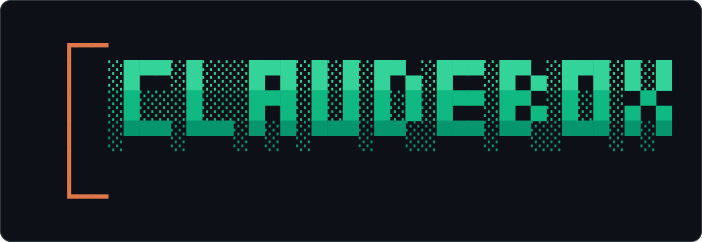

<p align="center">
  
</p>

<p align="center">
  
  
  
  
</p>

Sandboxed Docker dev boxes for running **Claude Code in no-prompt auto-mode** with GPU and shared
memory. The container is the security boundary; Claude runs unattended without touching the host.
One reusable base image; one `claudebox` CLI; a thin profile per project.

**Declarative, not a `Dockerfile`.** The base image is built from a pinned Nix flake
(`flake.nix` + `nix/base-image.nix`, via `dockerTools.buildLayeredImage`) — the whole toolchain is
reproducible and pinned by content hash, with no layer-ordering or `apt`-drift surprises. That
reproducibility is uncommon for Docker dev environments.

---

## Quickstart

**One-time setup**

```bash
# put the CLI on PATH
ln -sf ~/dev/claudebox/bin/claudebox ~/.local/bin/claudebox   # ensure ~/.local/bin is on $PATH

# build the base image (Nix base + nvidia/cuda; slow first run, then cached)
claudebox build

# (VSCode only) drop the dev-container config into the project repo
cp ~/dev/claudebox/profiles/<project>/devcontainer.json ~/<project>/.devcontainer/devcontainer.json
```

**Each session — terminal**

```bash
claudebox up <project>       # start (or resume) the box
claudebox attach <project>   # shell in
# inside:
claude                       # auto-mode, sees your shared memory
```

**Each session — VSCode**

1. VSCode → Remote-SSH → host
2. Open `~/<project>` → **Reopen in Container**
3. The box comes up (GPU + shared memory + auto-mode); work normally.

---

## Commands

| Command | Does |
|---|---|
| `claudebox build` | Build the Nix base image → `docker load` (`claudebox-base:latest`) |
| `claudebox up <project>` | Start the box, or resume it if it already exists |
| `claudebox attach <project>` | Open a shell in the box (`docker exec -it … bash`) |
| `claudebox down <project>` | Remove the box (state lives on the host, nothing is lost) |
| `claudebox status` | List boxes (running + stopped) |

---

## How a box is wired

**Mounts** (defined in `profiles/<name>/profile.toml`):

| Host path | In-box path | Mode | Purpose |
|---|---|---|---|
| `<workspace.host_path>` | same (1:1) | RW | project repo (live copy, not a clone) |
| `~/.claude` | `/home/dev/.claude` | RW | shared memory + auth (writeback to host) |
| `~/.cache/claudebox/<name>/pixi` | `/home/dev/.pixi` | RW | persisted pixi cache |
| any `[[mounts]]` entries | same or as configured | RO | extra data the project needs |

> Profiles are user/host-specific (absolute paths) and are git-ignored. The `example` profile ships
> as a reference; copy it (or `templates/`) to `profiles/<name>/` and edit it for your own project.

Nothing else of the host is visible.

- **Runs as your host uid/gid** — `--user "$(id -u):$(id -g)"` (CLI) / `updateRemoteUserUID`
  (VSCode). Nothing hardcodes a uid. (`whoami` may say *"I have no name!"* — harmless.)
- **Repo bound 1:1 at its host path** so Claude's project-memory slug matches the host and
  existing memories resolve correctly.
- **Auto-mode** is baked into the image at `/etc/claude-code/managed-settings.json`
  (`bypassPermissions`) — container-only, never shadows the bound `~/.claude`, never leaks to
  the host. Toggle the bind itself via `[claude] bind = false` in the profile.
- **Sandbox:** non-privileged, `--cap-drop ALL`, `--security-opt no-new-privileges`, no docker
  socket. (The VSCode config omits `--cap-drop` because VSCode needs caps to remap the user.)
- **GPU:** `--gpus all`. The base is FHS (`nvidia/cuda:12.8.1-devel-ubuntu24.04`) so the NVIDIA
  runtime injects the host driver + `libcuda.so`. PyTorch (cu128) brings its own CUDA runtime; the
  host supplies the driver. RTX 5090 / Blackwell (sm_120) needs CUDA ≥ 12.8 + PyTorch ≥ 2.7.
- **Ports:** published on `0.0.0.0`; served to the tailnet by the host's `tailscaled`.

---

## Durability

All real state lives in **host bind mounts**, never in the container:

- **Container stopped/killed:** nothing lost; `claudebox up` resumes the same box.
- **Host rebooted:** nothing lost; files are on the host disk; `up` re-creates/resumes the box.
- **Real loss only from:** disk failure with **unpushed commits** (→ push to GitHub), or work
  saved to a container path that isn't a mount (→ keep work in the repo). The pixi env is
  rebuildable.

---

## Networking

- **Internet: yes** — default Docker bridge (NAT through host). `claude`, `pixi install`, `git`
  all work.
- **Tailscale:** the box is **not** a tailnet node. Viz still reaches the tailnet because the box
  publishes ports on `0.0.0.0` and the **host's `tailscaled` serves them**.

---

## Set up a new project

```bash
# 1. Create the profile (or copy profiles/example/ as a filled-in reference)
mkdir -p profiles/<name>
cp templates/project.toml.template profiles/<name>/profile.toml
#    → edit: name, workspace host_path, ports, gpu.enabled, [[mounts]]

# 2. VSCode dev-container config
cp templates/devcontainer.json.template profiles/<name>/devcontainer.json
#    → edit: name, runArgs (ports/gpu), mounts
cp profiles/<name>/devcontainer.json ~/<name>/.devcontainer/devcontainer.json

# 3. GPU projects only
#    add profiles/<name>/pixi/gpu-feature.toml and merge it into the project's pyproject.toml

# 4. Start the box
claudebox up <name>
```

---

## Layout

```
bin/claudebox                  CLI (build/up/attach/down/status)
flake.nix, nix/base-image.nix  Nix tooling layered on the pinned FHS CUDA base
profiles/<name>/               profile.toml, devcontainer.json, pixi/gpu-feature.toml (git-ignored; local)
profiles/example/              committed reference profile
templates/                     project.toml + devcontainer.json templates
spec/claudebox-design.md       full design rationale
.claude/research/              nix-docker-cuda-gpu.md — why the base is FHS, not pure Nix
```

---

## Notes

- **Git identity in-box:** only `~/.claude` is mounted, not `~/.gitconfig`, so commits made
  inside the box have no author. Add a `~/.gitconfig` mount to the profile if you commit from
  in-box.
- **Viz URL host:** the banner's `viz` link uses `$CLAUDEBOX_HOST`, defaulting to the host's
  `hostname`. If your browser reaches the host by a different name (e.g. a Tailscale MagicDNS name),
  `export CLAUDEBOX_HOST=<that-name>` so the printed URL is reachable.
- **cuRobo** has no cu128 wheel — install from source after `torch.cuda.get_device_name()`
  confirms the GPU:
  `pixi run pip install --no-build-isolation git+https://github.com/NVlabs/curobo.git`
- **Updating the base CUDA image:** change the digest in `nix/base-image.nix`, set `hash` to
  `pkgs.lib.fakeHash`, run `claudebox build`, paste the reported hash back.
